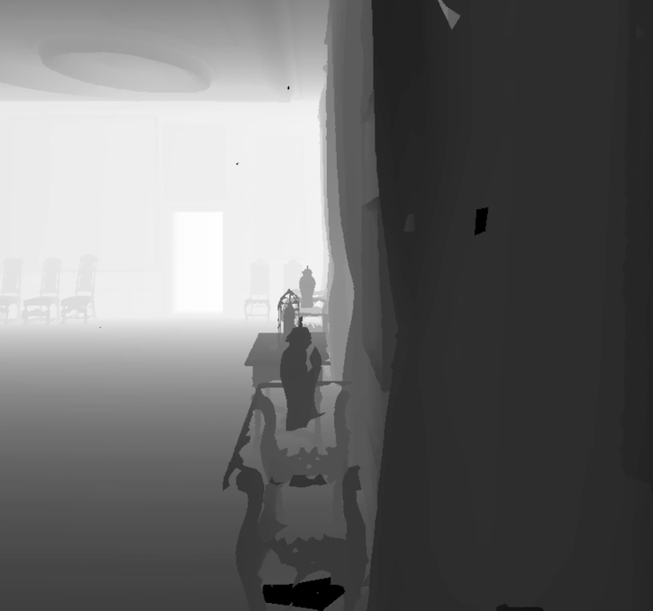

# Habitat Navigation Metrics Demo Project

This is a navigation metrics calculation and sensor performance comparison demo project based on Habitat-Sim. The project simulates navigation tasks with different sensor types (RGB, RGB-D, depth) to calculate key metrics such as SPL (Success weighted by Path Length) and path length, while generating high-quality navigation demo videos.

## Videos
[](https://www.bilibili.com/video/BV1cwaRzpEr7/?spm_id_from=333.1387.upload.video_card.click&vd_source=3e9614880d00ee2633a68b2f76988428)
[](https://www.bilibili.com/video/BV1rwaRzpEBs/?spm_id_from=333.1387.upload.video_card.click&vd_source=3e9614880d00ee2633a68b2f76988428)
[](https://www.bilibili.com/video/BV1FwaRzpEdA/?spm_id_from=333.1387.upload.video_card.click&vd_source=3e9614880d00ee2633a68b2f76988428)

## Dependency Installation

### 1. Create and activate conda environment

```bash
# Create new environment
conda create -n habitat_new python=3.8

# Activate environment
conda activate habitat_new
```

### 2. Install Habitat-Sim

```bash
# Install Habitat-Sim (CPU version)
conda install habitat-sim -c conda-forge -c aihabitat

# Or install GPU version (recommended)
conda install habitat-sim withbullet -c conda-forge -c aihabitat
```

### 3. Install other dependencies

```bash
# Basic scientific computing packages
conda install numpy scipy matplotlib

# Image processing
pip install opencv-python imageio imageio-ffmpeg

# Other utility packages
pip install tqdm
```

### 4. Complete dependency list

```bash
# Core dependencies
habitat-sim>=0.2.3
numpy>=1.19.0
opencv-python>=4.5.0
imageio>=2.9.0
imageio-ffmpeg>=0.4.0

# Optional dependencies
matplotlib>=3.3.0
scipy>=1.7.0
tqdm>=4.60.0
```

## Project Structure

```
habitat_demo/
├── data/
│   └── scene_datasets/
│       └── habitat-test-scenes/
│           ├── skokloster-castle.glb
│           ├── skokloster-castle.navmesh
│           └── habitat-test-scenes.scene_dataset_config.json
├── navigation_metrics_demo.py          # Main program file
├── navigation_metrics_results/         # Results output directory
│   ├── navigation_metrics.json        # Detailed metrics data
│   ├── comparison_report.md           # Comparison analysis report
│   └── videos/                        # Generated video files
│       ├── rgb_navigation_episode_1.mp4
│       ├── rgbd_navigation_episode_1.mp4
│       └── d_navigation_episode_1.mp4
└── README.md                          # Project documentation
```

After the program runs, results will be saved in the `navigation_metrics_results/` directory:

- **JSON Data**: `navigation_metrics.json` - Contains all detailed metrics data
- **Analysis Report**: `comparison_report.md` - Human-readable comparison analysis report
- **Demo Videos**: MP4 files in the `videos/` directory

## Output Description

### Navigation Metrics

- **SPL (Success weighted by Path Length)**: Success weighted by path length, range [0,1]
- **Path Length**: Total length of the actual navigation path
- **Shortest Path Length**: Straight-line distance from start to goal
- **Efficiency**: Ratio of shortest path length to actual path length
- **Success Rate**: Proportion of tasks that successfully reach the goal

### Sensor Comparison

The program compares three sensor types:

1. **RGB Sensor**: Uses only color image information
2. **RGB-D Sensor**: Uses both color image and depth information
3. **Depth Sensor**: Uses only depth information

### Video Output

- **Resolution**: 1024x1024 pixels
- **Frame Rate**: 30fps
- **Format**: MP4
- **Content**: Sensor perspective during robot navigation

## Configuration Parameters

You can modify the following parameters in `navigation_metrics_demo.py`:

```python
# Navigation task settings
navigation_tasks = [
    (np.array([5.0, 0.0, 5.0]), np.array([-5.0, 0.0, 12.0]))  # (start, goal)
]

# Success radius
success_radius = 1.0  # meters

# Video settings
settings['height'] = 1024  # video height
settings['width'] = 1024   # video width
```
